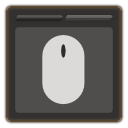

**Scrollable Tabs** is a lightweight plugin that lets you use the mouse wheel to switch tabs. 
 

The following windows are supported and can be toggled individually:

- Aether Currents
- Armoury Chest
- Blue Magic Spellbook
- Character
- Character -> Classes/Jobs
- Character -> Reputation
- Chocobo Saddlebag
- Companion
- Currency
- Facewear
- Fashion Accessories
- Field Records
- Fish Guide
- Glamour Dresser (scrolls pages, not tabs)
- Gold Saucer -> Card List
- Gold Saucer -> Decks -> Edit Deck
- Gold Saucer -> Lord of Verminion -> Minion Hotbar
- Inventory
- Island Minion Guide
- Minions
- Mounts
- Retainer Inventory
- Shared FATE
- Sightseeing Log

The Command Panel already includes this functionality and instead has an option to disable its tab-scrolling sound effect.

Plugin configuration is available via Plugin Installer.
